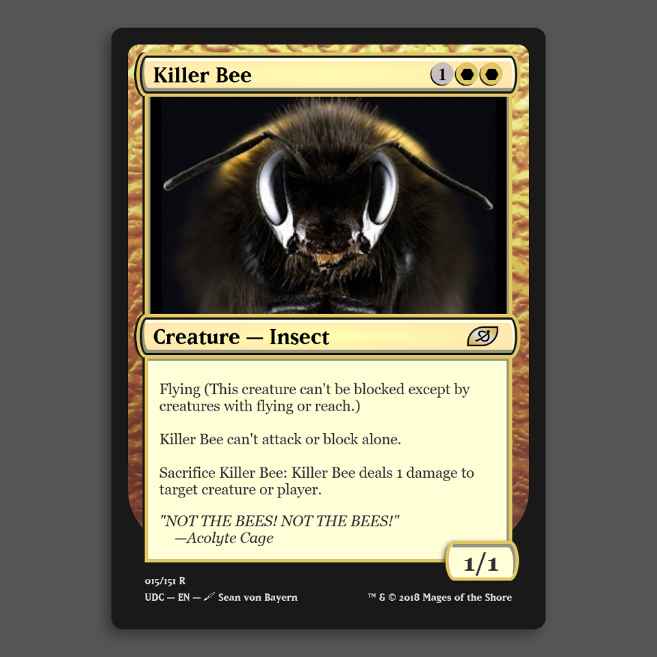

# Animal Trading Card

This trading card design is the first project that I completed using code of any kind. It was certainly overkill for the given assignment, but I remember really enjoying the discovery process of learning how to create those complicated borders and icons. At this point, I didn't know anything about responsive web design, so please enjoy it in all its static glory.

## Features

-   Uhh... Flying?

## Credits

-   This project was part of my [Intro to Programming Nanodegree](https://www.udacity.com/course/intro-to-programming-nanodegree--nd000).
-   "Magic: The Gathering" is owned by Wizards of the Coast, a subsidiary of Hasbro.
-   "Matrix Bold" and "Matrix Bold Script" were created by Zuzana Licko.

## License

Copyright © 2018 Sean von Bayern  
Licensed under the [MIT License](LICENSE.md)
